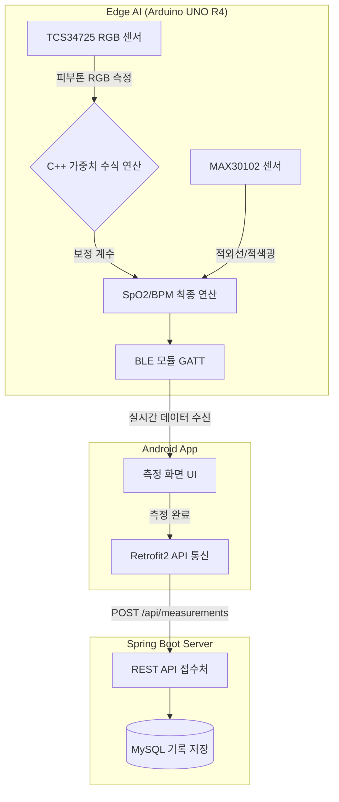

# 🩸 Edge AI 기반 피부톤 맞춤형 스마트 산소포화도 측정 시스템
> **(Smart SpO2 Monitoring System with Edge AI Skin Tone Calibration)**
>
> 💡 기존 광학식 산소포화도계의 **멜라닌 색소(피부톤) 왜곡 한계를 극복**하기 위해, AI가 피부톤을 즉각 판별하고 오차를 실시간 보정하는 지능형 웰니스 디바이스 및 모바일 앱입니다.

 

## 📢 1. 프로젝트 개요 (Project Overview)

- **프로젝트명:** Edge AI 기반 피부톤 맞춤형 스마트 산소포화도 측정 시스템
- **개발 기간:** 2026.03 ~ 2026.06 (약 14주)

**[기획 배경 및 문제 제기]**
현재 널리 사용되는 스마트워치나 의료용 광학식 산소포화도계(PPG 센서)는 LED 빛을 피부에 쏘아 반사되는 광량을 분석하여 수치를 산출합니다. 하지만 피부 표피의 **'멜라닌 색소'가 빛을 흡수하는 성질** 때문에, 피부톤이 어두울수록 광 신호가 왜곡되어 실제 수치와 큰 오차가 발생하는 구조적 한계가 의료계에서도 지적되어 왔습니다.

**[핵심 해결 방안 (Core Solution)]**
본 프로젝트는 이러한 하드웨어 센서의 물리적 한계를 **Edge AI와 소프트웨어 아키텍처로 극복**합니다. 
기존 MAX30102 센서에 정밀 RGB 컬러 센서(TCS34725)를 결합하여 측정자의 피부톤을 선제적으로 수치화합니다. 이후, 11,000개의 손 이미지 데이터(11K-Hands)로 사전 학습된 선형 회귀 AI 모델의 가중치(Weight) 공식을 아두이노 C++에 이식합니다. 이를 통해 기기 내부에서 짧은 시간안에 피부톤에 따른 오차 보정 계수를 산출하고, 산소포화도 연산 로직에 실시간으로 반영하여 정확도를 극대화합니다.

**[기대 효과 및 프로젝트 의의]**
모든 인종과 피부색에 차별 없이 신뢰성 높은 건강 데이터를 제공하는 **'포용적 헬스케어(Inclusive Healthcare)'** 기기의 기술적 기반을 마련합니다. 나아가 무거운 클라우드 AI 연산 대신 하드웨어 단에서 즉각적으로 처리되는 엣지 컴퓨팅(Edge Computing)을 구현하고, 모바일 앱과 클라우드 백엔드를 엮은 완전한 형태의 풀스택 IoT 웰니스 시스템을 완성하는 것을 목표로 합니다.

 

## 🛠 2. 기술 스택 (Tech Stack)

### 💻 Hardware & Edge AI
 
- **Arduino UNO R4 WiFi & C++:** 파이썬에서 추출한 Edge AI 수식(가중치)을 하드코딩하여 딜레이 없이 실시간으로 계산하고, 내장된 블루투스 모듈로 스마트폰과 데이터를 주고받습니다.
- **MAX30102:** 빛의 반사를 이용해 혈류량과 산소포화도(SpO2) 원시 데이터를 수집하는 메인 광학 센서입니다.
- **TCS34725:** 피부에 빛을 쏘아 정밀한 RGB(빨강, 초록, 파랑) 비율을 읽어내어 AI의 피부톤 판별 재료로 사용되는 컬러 센서입니다.

### 🧠 AI & Data Modeling
  
- **11K-Hands Dataset:** 피부톤(Skin Color) 라벨링이 완료된 11,000명의 손 이미지 오픈소스 데이터셋입니다.
- **Python & Scikit-learn:** 가벼운 '다중 선형 회귀' 알고리즘을 학습시켜, 아두이노 메모리에 들어갈 수 있는 최적의 오차 보정 공식(가중치)을 뽑아냅니다.

### 📱 Frontend (Android App)
  
- **Android Native (Java):** 아두이노에서 보정한 산소포화도 수치를 블루투스(BLE)로 받아, 실시간 심장 애니메이션과 함께 직관적인 화면으로 띄워주는 모바일 앱입니다.
- **Retrofit2 통신:** 측정이 완전히 끝나면 스마트폰의 인터넷망을 이용해 최종 결과를 백엔드 서버로 안전하게 전송합니다.

### ⚙️ Backend & Database
  
- **Spring Boot (REST API):** 안드로이드 앱에서 보내는 측정 데이터를 받아 무결성을 검사하는 전용 접수처(API) 서버입니다.
- **MySQL:** 수신된 건강 기록(심박수, 산소포화도)을 체계적이고 영구적으로 쌓아두는 데이터베이스입니다.
- **AWS EC2:** 시연 중에도 서버가 24시간 안정적으로 돌아갈 수 있도록 구축한 클라우드 가상 서버 환경입니다.

## 🏛 3. 시스템 아키텍처 (System Architecture)

전체 시스템은 **데이터 수집(하드웨어) ➔ 실시간 표출(안드로이드) ➔ 데이터 적재(스프링 서버)**의 3계층 파이프라인으로 구성되어 있습니다.

 

## 🏛 4. 하드웨어 설계 (Hardware structure)

### 🔌 부품 목록 (Parts List)
* **메인 보드:** Arduino UNO R4 WiFi x1
* **센서:** 산소포화도 측정 모듈(MAX30102) x1, 컬러 센서 모듈(TCS34725) x1
* **출력/입력:** 0.96인치 OLED 디스플레이 x1, 피에조 부저 x1, 푸쉬버튼 x1, 3색 LED x3
* **기타:** 220옴 저항 x3, 830핀 브레드보드 x3, 점퍼 케이블(수수/암암/암수)

### 💡 설계 참고사항
* MAX30102, OLED, TCS34725 모듈은 모두 **I2C 통신**을 사용하므로 **SCL, SDA 핀에 3개의 모듈을 병렬로 연결**합니다.
* 실제 배선은 시각적 가독성을 위해 설계도 이미지와 차이가 있을 수 있습니다.

 

## 🧠 5. AI 모델 설계 및 학습 (AI Model & Training)

본 프로젝트의 핵심인 피부톤 판별 알고리즘은 **저사양 엣지 디바이스(Arduino)**에서도 지연 없이 구동될 수 있도록 '데이터 정제'와 '모델 경량화'에 초점을 맞추어 설계되었습니다.

### 🧪 스마트 데이터 전처리 (Preprocessing Pipeline)
단순 이미지 분석의 한계를 극복하고 센서 실측 환경과의 간극을 좁히기 위해 다음과 같은 고도화된 전처리 공정을 적용했습니다.

* **HSV Skin Masking:** RGB 대비 조명 변화에 강인한 **HSV 색 공간**을 활용하여 피부가 아닌 배경, 그림자, 손톱 영역을 물리적으로 제거했습니다.
* **Median Feature Extraction:** 픽셀값의 평균(Mean) 대신 **중앙값(Median)**을 취함으로써 사진 내의 미세한 노이즈와 반사광의 간섭을 차단했습니다.
* **Feature Engineering ($R\_Ratio$):** 절대적인 밝기가 변해도 유지되는 색 구성비 지표인 $R\_Ratio = \frac{R}{R+G+B}$를 추가하여 조명 환경에 대한 강인함(Robustness)을 확보했습니다.

### 🤖 모델 아키텍처 및 최적화 (Model Optimization)
임베디드 시스템의 자원 제약을 고려하여 **의사결정나무(Decision Tree)** 모델을 채택하고 하드웨어 이식을 위한 최적화를 진행했습니다.

* **분류 체계:** 3-Tier Classification (Fair, Medium, Dark)
* **최적화 기법:**
    * **Depth Constraining:** 아두이노의 플래시 메모리 용량을 고려하여 **Max Depth 10**으로 제한.
    * **Code Generation:** 학습된 트리 구조를 C++의 `if-else` 문으로 자동 번역하여 하드코딩 방식으로 이식.

### 📈 학습 결과 및 성능 지표 (Performance)
실험을 통해 전처리 및 특성 공학 도입 전후의 성능 차이를 검증했습니다.

| 모델 설정 | 테스트 정확도 (Test Acc) | 비고 |
| :--- | :---: | :--- |
| 초기 모델 (Raw RGB) | 약 48.19% | 조명 및 배경 노이즈에 취약 |
| **최종 채택 모델 (Depth 10)** | **63.31%** | **정확도와 이식성 사이의 최적 밸런스** |
| 고성능 모델 (Depth 15) | 70.31% | 과적합 및 메모리 초과 위험 |

 

## 🧮 6. 알고리즘 이식 및 보정 로직 (Implementation & Calibration)

기존 센서의 경험식에 AI가 도출한 피부톤 보정 계수를 결합하여, 하드웨어 단에서 즉각적으로 오차를 교정하는 **4단계 수학적 파이프라인**을 구축했습니다.

 

### 🩸 Step 1. 빛 흡수율 비율 (Ratio, R) 산출
가장 먼저 심장 박동에 따른 혈류량 변화를 파악하기 위해 적색광(Red)과 적외선(IR)의 흡수율 비율을 계산합니다.

> **R = (AC_Red / DC_Red) / (AC_IR / DC_IR)**

* **AC (교류 성분):** 맥박에 따라 변하는 동맥혈의 빛 흡수량
* **DC (직류 성분):** 뼈, 조직, 정맥혈 등에 의해 일정하게 흡수되는 빛의 양

 

### 📊 Step 2. 기본 산소포화도 (SpO2_Raw) 도출
측정된 R 값을 센서 제조사(Maxim Integrated)의 임상 실험 기반 경험식(Empirical Formula)에 대입하여, 피부톤 오차가 포함된 1차 산소포화도를 구합니다.

> **SpO2_Raw = 104 - (17 * R)**

* **104 (A):** 빛 흡수율 비율이 0일 때의 이론적 최대 산소포화도 기본 상수
* **17 (B):** R 값 증가에 따른 산소포화도 감소 기울기 상수

 

### ⚖️ Step 3. Edge AI 피부톤 보정 가중치 (W_skin) 산출
이 프로젝트의 핵심인 컬러 센서 데이터(TCS34725)를 활용하는 단계입니다. 멜라닌 색소가 빛 흡수에 미치는 오차를 잡기 위해 피부톤에 따른 보정값을 계산합니다.

> **W_skin = α * (C_skin - C_ref)**

* **W_skin:** 피부톤 보정 가중치 (Weight)
* **C_skin:** 컬러 센서로 측정한 사용자의 현재 피부톤 데이터 (예: 명도, RGB 변환값 등)
* **C_ref:** 오차가 0에 가까운 기준이 되는 표준 피부톤 상수
* **α (보정 계수):** 실제 상용 의료용 펄스옥시미터(Ground Truth)와의 오차 데이터를 선형 회귀 분석(Linear Regression)하여 실험적으로 튜닝해 낸 오차율 조정 기울기

 

### 🎯 Step 4. 최종 산소포화도 (SpO2_Final) 확정
분류된 피부톤 티어(Fair, Medium, Dark)에 맞춰 산출된 가중치를 기본 측정값에 결합하여, 멜라닌 색소의 방해를 걷어낸 최종 캘리브레이션 수치를 도출합니다.

> **SpO2_Final = SpO2_Raw + W_skin**

* **Tier 1 (Fair):** 멜라닌 영향 적음 → **W_skin ≈ 0** (표준 보정값 유지)
* **Tier 2 (Medium):** 중간 농도 멜라닌 보정 → **1단계 α** 수치 오차 보정 적용
* **Tier 3 (Dark):** 고농도 멜라닌 광 신호 왜곡 보정 → **최대 α** 보정 계수 적용

 

### ⚙️ Step 5. Edge AI 알고리즘 하드웨어 이식 (C++ Code Generation)
파이썬(Python) 환경에서 학습을 마친 머신러닝 모델(Decision Tree)을 임베디드 환경에서 구동하기 위해, 아두이노가 직관적으로 연산할 수 있는 C++ 언어로 자동 변환하여 펌웨어에 이식합니다.

> **Python Model → C++ `if-else` 하드코딩 변환 → Arduino 펌웨어 업로드**

* **모델 경량화 (Lightweighting):** 아두이노 메모리에 부담을 주지 않도록 트리의 깊이(Depth)를 10으로 제한하고, 무거운 ML 라이브러리 없이 순수 조건문(`if-else`)으로 하드코딩하여 메모리 용량을 최적화했습니다.
* **실시간 엣지 컴퓨팅 (Edge Computing):** 외부 클라우드나 스마트폰의 연산 능력을 빌리지 않고, 아두이노 R4 보드 자체 내장 프로세서만으로 센서값 판별부터 최종 SpO2 보정까지 지연 시간 없이 즉각적으로 처리합니다.

 

## 📂 7. 프로젝트 파일 구성 (Repository Structure)

* `main.py`: AI 모델 학습 및 전처리 통합 스크립트.
* `requirements.txt`: 프로젝트 실행을 위한 Python 라이브러리 목록.
* `/arduino`: 아두이노 메인 스케치 및 AI 판별 함수 (`predictSkinTier.h`).
* `/android`: 안드로이드 자바 소스 코드.
* `/backend`: 스프링 부트 서버 소스 코드.
* [**📊 상세 데이터 분석 리포트 (HTML 확인)**](https://JsRenaissance.github.io/SkinTone-SpO2-AI/11kfin.html)

 
© 2026 Your Name. All Rights Reserved.

